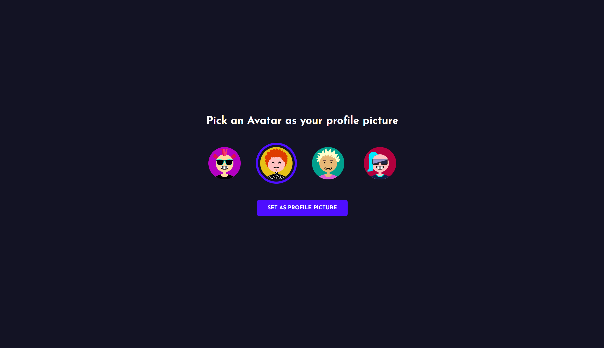
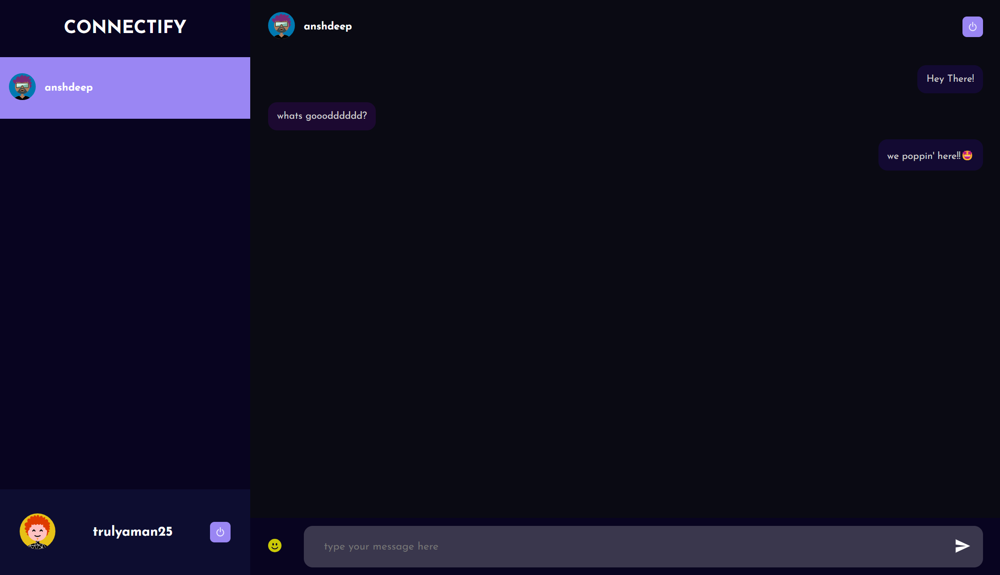

# Connectify

Welcome to Connectify, a real-time chatting application built using modern web technologies. Connectify offers a secure and interactive platform for users to communicate with each other seamlessly.

## Table of Contents

- [Features](#features)
- [Technologies Used](#technologies-used)
- [Installation](#installation)
- [Usage](#usage)
- [Project Structure](#project-structure)
- [Contributing](#contributing)
- [License](#license)

## Features

- Real-time messaging with Socket.IO
- Secure user authentication and data encryption with bcrypt
- Responsive design with HTML and CSS
- User-friendly interface built with React.js
- Persistent data storage with MongoDB
- RESTful API with Express.js

## Technologies Used

- **Front-end:**
  - React.js
  - HTML
  - CSS

- **Back-end:**
  - Node.js
  - Express.js
  - Socket.IO
  - MongoDB
  - bcrypt (for data encryption)

- **Package Managers:**
  - npm
  - yarn

## Installation

Follow these steps to set up the project on your local machine.

### Prerequisites

- Node.js installed
- npm or yarn installed
- MongoDB installed and running

### Clone the Repository

```bash
git clone https://github.com/yourusername/connectify.git
cd connectify
```

### Install Dependencies
You can install the dependencies using either npm or yarn.

using npm
```bash
npm install
```

using yarn
```bash
yarn install
```

### Set Up Environment Variables
Modify the env variables as per your needs!
```bash
MONGO_URI=your_mongodb_connection_string
PORT=your_preferred_port
SECRET_KEY=your_secret_key_for_jwt
```

### Run the Application
Using npm:
```bash
npm start
```

Using yarn:
```bash
yarn start
```


### Usage
 - Open your web browser and navigate to ```http://localhost:your_port```
 - Sign up for a new account or log in with your existing credentials.
 - Start chatting with your friends in real-time.

---

### Contributing
We welcome contributions to Connectify! If you would like to contribute, please follow these steps:

 - Fork the repository.
 - Create a new branch with a descriptive name.
 - Make your changes and commit them with clear messages.
 - Push your changes to your fork.
 - Create a pull request to the main repository.
 - Please ensure your code adheres to the project's coding standards and includes tests where applicable.

 ---

 ## Images

  
  
  

---